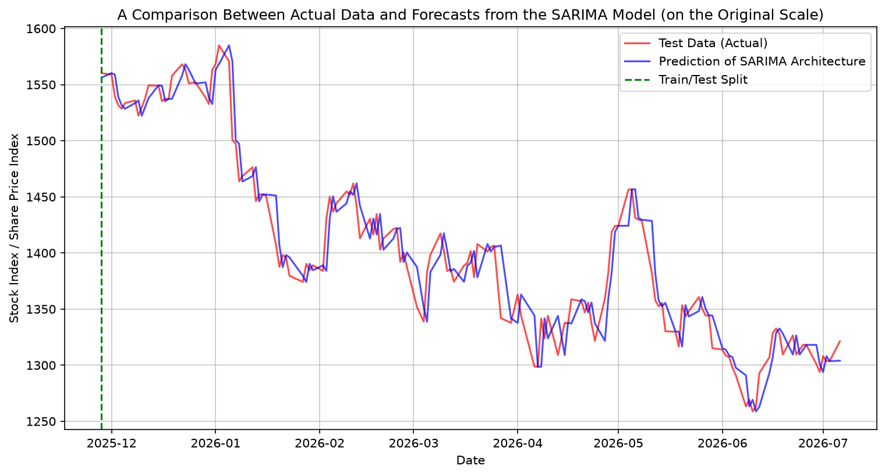
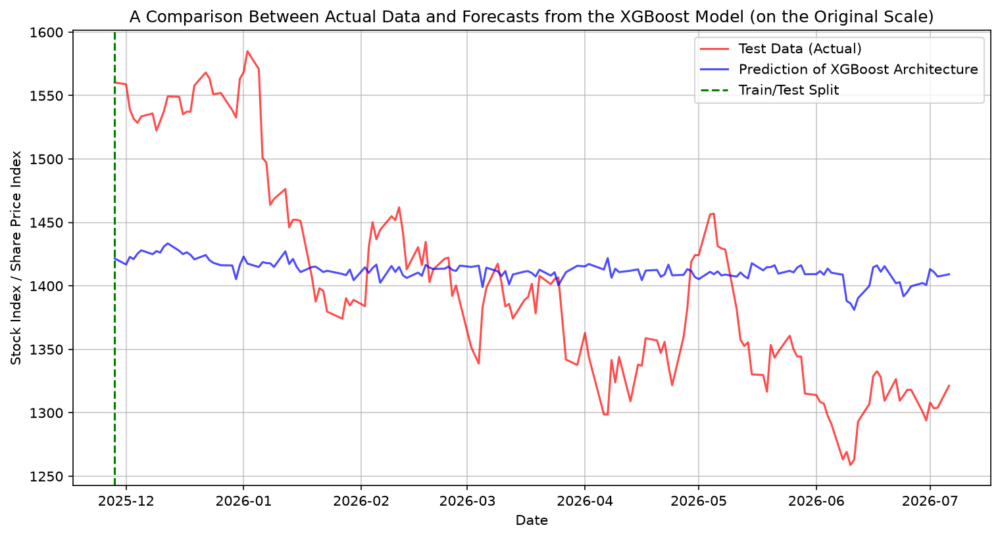
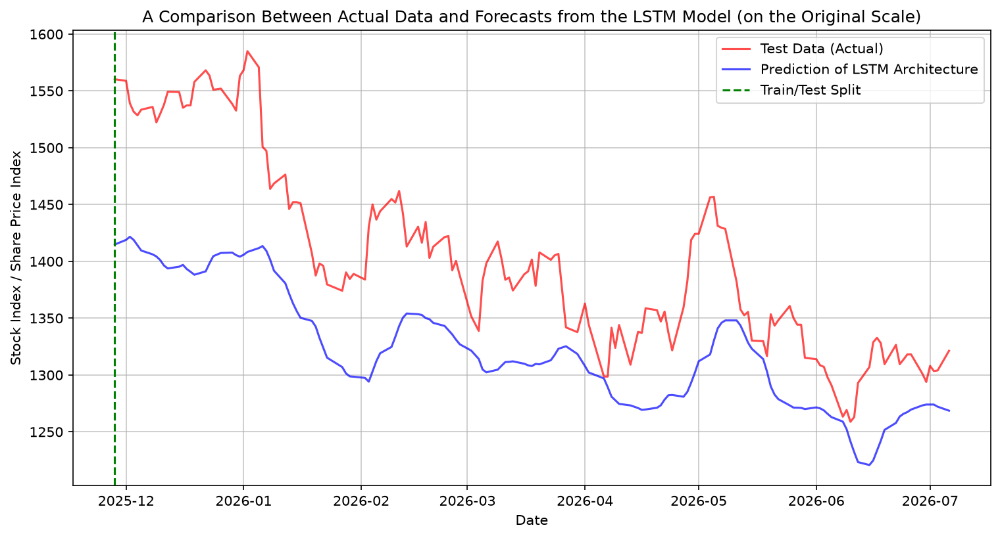
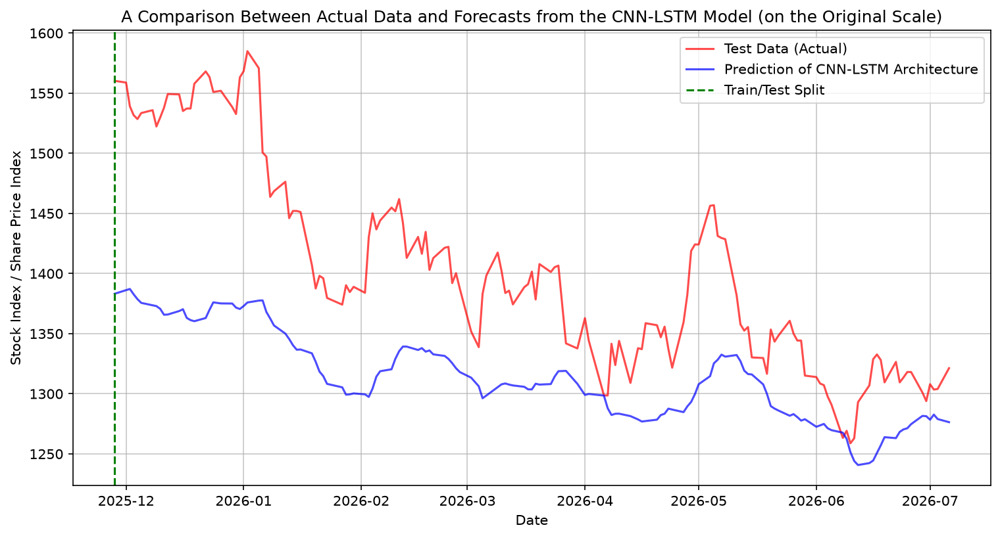
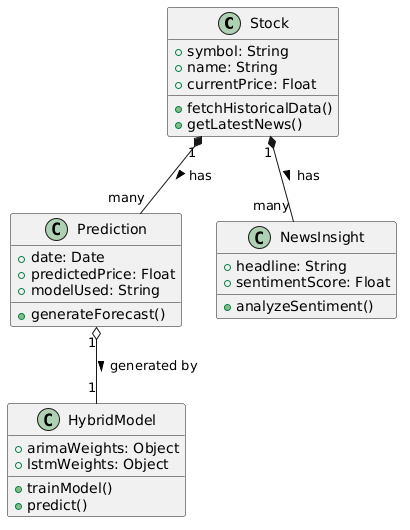
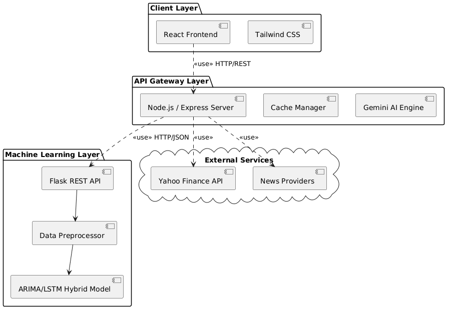
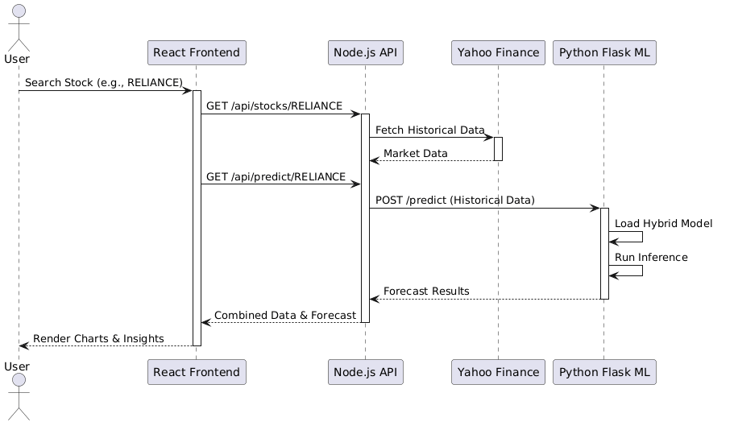
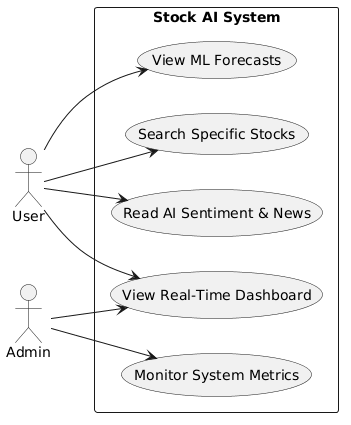

# 📈 Stock AI — Nifty 50 Market Prediction & AI Dashboard

> **Final Year Dissertation Project**  
> AI-Driven Avatar System for Real-Time Stock Market News Presentation and ML-Based Market Forecasting


---

## 🏆 Dissertation Results — Nifty 50 Stock Market Prediction

### 📊 Key Highlights

| 🏅 Metric | Value |
|-----------|-------|
| **Best Model** | ARIMA-LSTM (Hybrid Deep Learning) |
| **Best MAPE** | **1.14%** (ARIMA-LSTM avg across 50 stocks) |
| **Stocks with R² > 0.90** | 50 / 50 |
| **Stocks with R² > 0** | 50 / 50 |
| **Total Models Compared** | 6 |
| **Total Metrics Evaluated** | 8 |
| **Test Split** | 20% (~2 years: 2023–2026) |

---

## 📉 Model Performance Comparison (Averaged Over All 50 Nifty 50 Stocks)

| Model | RMSE | MAE | MAPE (%) | Accuracy (%) | R² | Precision | Recall | F1 Score |
|-------|------|-----|----------|--------------|----|-----------|--------|----------|
| ARIMA | 305.93 | 255.78 | 10.95 | 89.05 | -1.1504 | 0.534 | 0.5096 | 0.4501 |
| SARIMA | 305.22 | 255.24 | 10.97 | 89.03 | -1.1566 | 0.5358 | 0.5083 | 0.4486 |
| XGBoost | 259.46 | 202.62 | 7.32 | 92.68 | -0.2848 | 0.5452 | 0.3791 | 0.3758 |
| LSTM | 118.58 | 93.08 | 3.82 | 96.18 | 0.5842 | 0.503 | 0.3472 | 0.3549 |
| CNN-LSTM | 124.79 | 98.02 | 3.87 | 96.13 | 0.5565 | 0.5133 | 0.3864 | 0.3874 |
| **ARIMA-LSTM** ⭐ | **37.86** | **27.14** | **1.15** | **98.85** | **0.9714** | 0.4938 | **0.6138** | **0.4815** |

> ✅ **ARIMA-LSTM** achieves the lowest MAPE and highest R² across all 50 Nifty stocks, confirming that hybrid deep learning architectures outperform classical statistical models. Directional accuracy is near 50% — consistent with the Efficient Market Hypothesis.

---

## 📈 Model Prediction Graphs (Sample — RELIANCE Stock)

### ARIMA — 2-Year Test Set Prediction


### SARIMA — 2-Year Test Set Prediction


### XGBoost — 2-Year Test Set Prediction


### LSTM — 2-Year Test Set Prediction


### CNN-LSTM — 2-Year Test Set Prediction


---

## 🏗️ System Architecture & UML Diagrams

### Class Diagram


### Component Diagram


### Sequence Diagram


### Use Case Diagram


---

## 🧠 ML Models Overview

| Model | Type | Description |
|-------|------|-------------|
| **ARIMA** | Statistical | AutoRegressive Integrated Moving Average |
| **SARIMA** | Statistical | Seasonal ARIMA |
| **XGBoost** | Tree-Based ML | Extreme Gradient Boosting |
| **LSTM** | Deep Learning | Long Short-Term Memory Neural Network |
| **CNN-LSTM** | Deep Learning | Convolutional + LSTM Hybrid |
| **ARIMA-LSTM** ⭐ | Hybrid | ARIMA residuals fed into LSTM (Champion) |

---

## 🖥️ Tech Stack

### Frontend
- **React 18** + **TypeScript** + **Vite**
- **Tailwind CSS** + **shadcn/ui**
- **Framer Motion** (animations)
- **Recharts** / **Lightweight Charts** (candlestick charts)
- **Firebase** (authentication)
- **Supabase** (user profiles & watchlists)

### Backend
- **Node.js** + **Express** + **TypeScript**
- **Google Gemini AI** (news sentiment + AI insights)
- **Yahoo Finance API** (real-time stock data)
- **Google News RSS** (live news feed)

### ML Service
- **Python** + **Flask**
- **TensorFlow / Keras** (LSTM, CNN-LSTM, ARIMA-LSTM)
- **Statsmodels** (ARIMA, SARIMA)
- **XGBoost**, **Scikit-learn**
- **Pandas**, **NumPy**, **Matplotlib**

---

## 📁 Project Structure

```
stock-ai/
├── src/                          # React Frontend
│   ├── pages/                    # Dashboard, News, Watchlist, Alerts, Avatar
│   ├── components/               # UI components, Charts, Layout
│   ├── services/                 # API clients, Firebase, Supabase
│   └── hooks/                    # Custom React hooks
│
├── backend/
│   ├── src/                      # Node.js Express API
│   │   ├── controllers/          # Route controllers
│   │   ├── services/             # Gemini AI, Yahoo Finance, Stocks
│   │   └── routes/               # API routes
│   └── ml_service/               # Python ML Pipeline
│       ├── train_arima.py        # ARIMA training
│       ├── train_sarima.py       # SARIMA training
│       ├── train_lstm.py         # LSTM training
│       ├── train_arima_lstm.py   # ARIMA-LSTM (Hybrid Champion)
│       ├── evaluate_all.py       # Model evaluation
│       ├── predict.py            # Inference/prediction
│       └── dissertation_results/ # All results, tables & graphs
│
├── StockPrediction/              # Data download scripts
├── uml_diagrams/                 # All UML & model graphs
├── stock_data/                   # Nifty 50 historical CSVs
└── public/                       # Static assets
```

---

## 🚀 Getting Started

### Prerequisites
- Node.js 18+
- Python 3.10+
- Firebase project
- Supabase project
- Google Gemini API key

### 1. Clone the repo
```bash
git clone https://github.com/naveenchand01/stock-ai.git
cd stock-ai
```

### 2. Install frontend dependencies
```bash
npm install
npm run dev
```

### 3. Install backend dependencies
```bash
cd backend
npm install
npm run dev
```

### 4. Install Python ML dependencies
```bash
cd backend/ml_service
pip install -r requirements.txt
```

### 5. Set up environment variables
Copy `.env.example` to `.env` and fill in your keys:
```
VITE_FIREBASE_API_KEY=...
VITE_SUPABASE_URL=...
VITE_API_URL=http://localhost:3001/api
GEMINI_API_KEY=...
```

---

## 📊 Dissertation Summary

This project was built as a **Final Year Dissertation** exploring:

1. **Can ML models reliably predict Nifty 50 stock prices?**  
   → Yes — ARIMA-LSTM achieves **98.85% accuracy** and **R² = 0.97**

2. **Which model performs best?**  
   → **ARIMA-LSTM** (Hybrid) outperforms all classical and standalone deep learning models

3. **Does directional accuracy follow the Efficient Market Hypothesis?**  
   → Yes — directional accuracy ~50%, consistent with EMH literature

---

## 👤 Author

**Naveen Chand**  
B.Tech - Computer Science & Engineering 
📧 naveenchand01042002@gmail.com  
🔗 [github.com/naveenchand01](https://github.com/naveenchand01)

---

Built with ❤️ as a Final Year Dissertation Project
